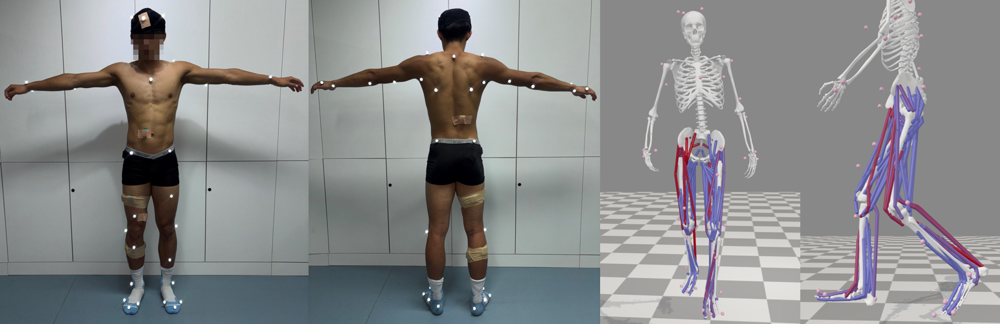

# Gait2Hip-60

Gait2Hip-60 is a multi-cadence gait dynamics dataset from 60 healthy subjects. The dataset provides trial-level OpenSim-derived gait biomechanics data, including inverse kinematics (IK), inverse dynamics (ID), and static-optimization-derived muscle force outputs, together with NPZ files for machine learning and deep learning applications.




This GitHub repository provides example scripts and benchmark code for using the released NPZ files in machine learning and deep learning applications.

The full dataset is available on **Zenodo**.

```text
https://doi.org/10.5281/zenodo.20175768
```
> **Important note**  
> The muscle forces and joint moments provided in this dataset are derived from an OpenSim musculoskeletal modeling pipeline. They should be interpreted as simulation-based estimates rather than direct in vivo measurements.

---

## Data availability
The Zenodo release includes:

| File | Description |
|---|---|
| `Gait2Hip-60.zip` | Complete dataset archive containing trial-level OpenSim-derived outputs |
| `Gait2Hip_MF60.npz` | NPZ file for right-hip-related muscle force analysis and prediction |
| `Gait2Hip_JM60.npz` | NPZ file for right hip joint moment analysis and prediction |
| `subject_info.csv` | Subject information |

Large dataset files are not stored directly in this GitHub repository.

After downloading the NPZ files from Zenodo, place them in the `data/` folder:

```text
data/
├── Gait2Hip_MF60.npz
└── Gait2Hip_JM60.npz
```
---
## Repository structure

```text
Gait2Hip-60/
├── README.md
├── LICENSE
├── requirements.txt
├── .gitignore
│
├── data/
│   └── README.md
│
├── examples/
│   ├── load_Gait2Hip_MF60.py
│   └── load_Gait2Hip_JM60.py
│
├── muscle_force_prediction/
│   ├── LSTM_MF60.py
│   ├── Mamba_MF60.py
│   ├── Transformer_MF60.py
│   ├── predict.py
│   ├── trained_models/
│   │   ├── LSTM_MF60.pt
│   │   ├── Mamba_MF60.pt
│   │   └── Transformer_MF60.pt
│   └── README.md
│
└── joint_moment_prediction/
    ├── LSTM_JM60.py
    ├── Mamba_JM60.py
    ├── Transformer_JM60.py
    ├── predict.py
    ├── trained_models/
    │   ├── LSTM_JM60.pt
    │   ├── Mamba_JM60.pt
    │   └── Transformer_JM60.pt
    └── README.md
```

---

## Dataset overview

Gait2Hip-60 contains gait data from 60 healthy adults labeled from `H01` to `H60`.

Walking trials were performed under three metronome-paced cadence conditions:

| Condition label | Cadence |
|---|---:|
| `slow` | 78 steps/min |
| `med` | 115 steps/min |
| `fast` | 135 steps/min |

Each subject was expected to have up to four repeated trials under each cadence condition. After quality-control and file consistency checks, the public NPZ files contain **713 valid gait trials**.

---

## NPZ file format

The released NPZ files contain the following fields:

| Key | Description |
|---|---|
| `X` | Input sequence array |
| `Y` | Target sequence array |
| `subject_id` | Subject ID for each sample |
| `height_m` | Subject height in meters |
| `weight_kg` | Subject body mass in kilograms |
| `speed_label` | Legacy condition label: `slow`, `med`, or `fast` |
| `in_cols` | Names of input variables |
| `out_cols` | Names of output variables |

Typical array dimensions are:

```text
X: (N, 180, D_in)
Y: (N, 180, D_out)
```

where:

- `N` is the number of valid gait samples;
- `180` is the sequence length;
- `D_in` is the number of input kinematic variables;
- `D_out` is the number of output variables.

> Note: `speed_label` is a legacy field name retained for compatibility with the released code and scripts. In this dataset, it represents the metronome-paced cadence condition rather than directly measured walking speed. The labels `slow`, `med`, and `fast` correspond to 78, 115, and 135 steps/min, respectively.

---

## Input and output variables

### Input variables

The NPZ input array contains 10 lower-limb kinematic variables:

```text
hip_flexion_r
hip_adduction_r
hip_rotation_r
hip_flexion_l
hip_adduction_l
hip_rotation_l
knee_angle_r
ankle_angle_r
knee_angle_l
ankle_angle_l
```

### Muscle force outputs

`Gait2Hip_MF60.npz` contains 14 right-hip-related muscle force outputs:

```text
addbrev_r
addlong_r
addmag_r
grac_r
iliopsoas_r
recfem_r
sart_r
glmax_r
bflh_r
hamstring_r
glmed_r
glmin_r
tfl_r
piri_r
```

### Joint moment outputs

`Gait2Hip_JM60.npz` contains 3 right hip joint moment outputs:

```text
hip_flexion_r_moment
hip_adduction_r_moment
hip_rotation_r_moment
```

---

## Units

The released NPZ files store the biomechanical outputs in their original units:

- input joint kinematics: degrees;
- muscle force outputs: Newtons (N);
- joint moment outputs: Newton-meters (N·m);
- subject body mass: kilograms (kg);
- subject height: meters (m).

In the provided training scripts, target outputs are normalized by body mass before model training:

- muscle force prediction: `N/kg`;
- joint moment prediction: `Nm/kg`.

Users may choose either the original-unit targets or body-mass-normalized targets depending on their own research purpose.

---

## Environment requirements

The code was developed and tested with the following environment:

- Python 3.10
- PyTorch
- NumPy
- Pandas
- Scikit-learn
- Matplotlib
- tqdm

The Mamba baseline additionally requires:

- mamba-ssm
- causal-conv1d

Mamba-related package installation may depend on the local CUDA, PyTorch, and compiler versions.

---

## Quick start

### Load the muscle force NPZ file

```bash
python examples/load_Gait2Hip_MF60.py
```

### Load the joint moment NPZ file

```bash
python examples/load_Gait2Hip_JM60.py
```

The example scripts print the available keys, array shapes, input variables, output variables, condition labels, and a preview of the first trial.

---

## Model training and prediction

Detailed instructions are provided in the task-specific README files:
```text
muscle_force_prediction/README.md
joint_moment_prediction/README.md
```

### Muscle force prediction

Train the baseline models:
```bash
python muscle_force_prediction/LSTM_MF60.py
python muscle_force_prediction/Mamba_MF60.py
python muscle_force_prediction/Transformer_MF60.py
```

Run prediction using the trained Transformer model:
```bash
python muscle_force_prediction/predict.py \
    --model_path muscle_force_prediction/trained_models/Transformer_MF60.pt
```
To also save predictions in the original unit `N`, use:
```bash
python muscle_force_prediction/predict.py \
    --model_path muscle_force_prediction/trained_models/Transformer_MF60.pt \
    --save_raw_unit
```

### Joint moment prediction

Train the baseline models:
```text
python joint_moment_prediction/LSTM_JM60.py
python joint_moment_prediction/Mamba_JM60.py
python joint_moment_prediction/Transformer_JM60.py
```
Run prediction using the trained Transformer model:
```bash
python joint_moment_prediction/predict.py \
    --model_path joint_moment_prediction/trained_models/Transformer_JM60.pt
```
To also save predictions in the original unit `N·m`, use:
```bash
python joint_moment_prediction/predict.py \
    --model_path joint_moment_prediction/trained_models/Transformer_JM60.pt \
    --save_raw_unit
```
Prediction results are saved as CSV files under:
```text
muscle_force_prediction/predictions/
joint_moment_prediction/predictions/
```
---

## Benchmark protocol

The provided baseline scripts use subject-level splitting. A subject-holdout test set is first separated, and 5-fold GroupKFold cross-validation is performed on the remaining training/validation pool for epoch selection. The final model is then trained on the full pool and evaluated on the independent test subjects.
The implemented baseline models are:

- LSTM;
- Transformer;
- Mamba.

The reported metrics include:
- RMSE;
- MAE;
- R²;
- subject-level mean metrics;
- cadence-specific test metrics.
---

## Reference results

The full benchmark results are reported in the associated manuscript.

```text
To be added when available.
```
---

## Recommended use

Gait2Hip-60 can be used for research on:

- gait biomechanics;
- musculoskeletal modeling;
- hip dynamics analysis;
- machine learning-based biomechanical estimation;
- time-series modeling;
- deep learning model development and evaluation.

---

## Citation

If you use this dataset or code, please cite the associated dataset record and publication when available.

Dataset title:

```text
Gait2Hip-60: A Multi-Cadence Gait Dynamics Dataset
```

Zenodo record:

```text
https://doi.org/10.5281/zenodo.20175768
```

Publication:

```text
To be added when available.
```

---

## License

The dataset is released under the license specified on the Zenodo record.

The source code in this repository is released under the license specified in this GitHub repository.

Please check the license files before reuse.

---

## Contact

For questions about the dataset or code, please contact:

```text
Jiaqi Zhang
Capital University of Physical Education and Sports
Email: jackie4real@outlook.com
```
